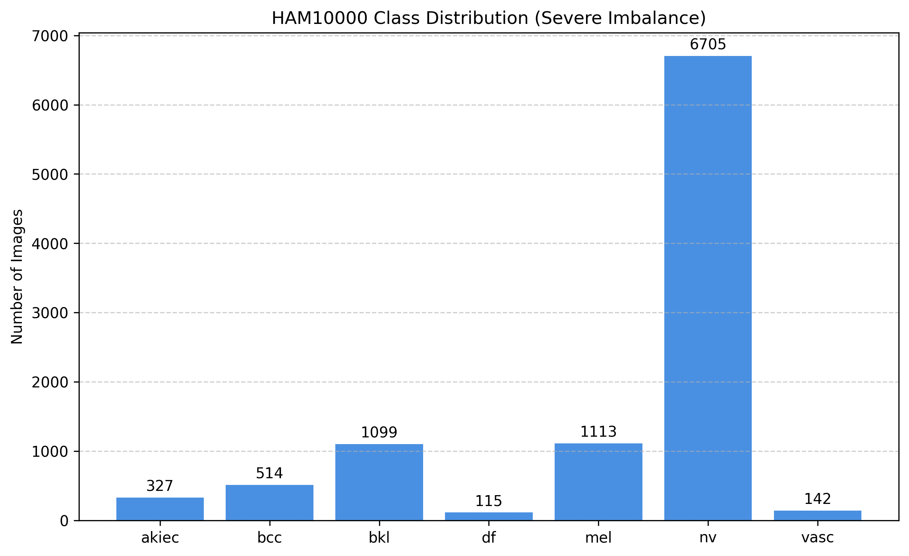
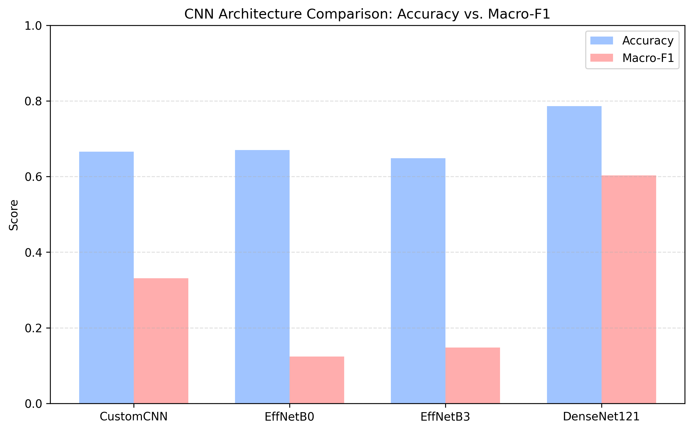
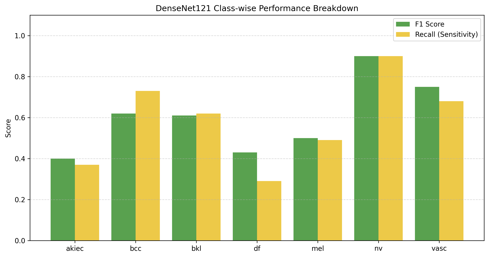
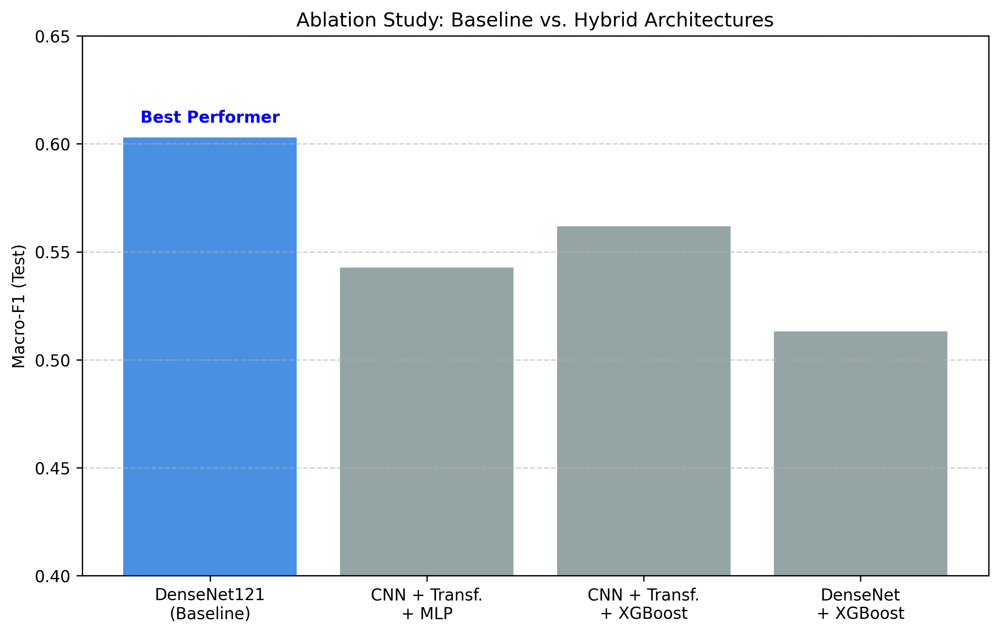

# SCC-ALAR(Skin Cancer Classifier using Advanced Learning Architectures)
## Project Metadata

## Model Architectures
- **Primary Model:** DenseNet121 (Baseline)
- **Secondary Architectures:** EfficientNet (B0, B3), Custom CNN
- **Hybrid Modules:** Transformer Encoders, XGBoost Classifiers

## Dataset
- **Name:** HAM10000  
- **Description:** 10,015 Dermoscopic Images

## Frameworks & Libraries
- TensorFlow 2.19.0  
- Keras  
- Scikit-learn  
- XGBoost  

## Environment
- **Platform:** Kaggle Notebooks  
- **Compute:** Dual NVIDIA Tesla T4 GPUs  
- **GPU Memory:** 16 GB VRAM  
- **Runtime:** Python 3.12.12  
- **Storage:** Kaggle Input Datasets (HAM10000)

## Evaluation Focus
- **Primary Metric:** Macro-F1 Score (balanced class performance)


## Reproducibility & Environment
All experiments were developed and executed on the Kaggle platform to ensure consistent hardware acceleration and environment stability.

- **Accelerator:** NVIDIA Tesla T4  
- **GPU Configuration:** 2 × Tesla T4  


## Technical Implementation Details

### Optimization Policy
- Enabled `mixed_float16` global policy to accelerate training on Tesla T4 GPUs.

### Hyperparameters
- **Learning Rate (Head Training):** 1e-4  
- **Learning Rate (Fine-tuning):** 1e-5  
- **Fine-tuning Strategy:** Unfroze the top 40% of backbone layers after initial head convergence.

### XGBoost Configuration
- **Objective:** `multi:softprob`  
- **Estimators:** 300  
- **Learning Rate:** 0.05  
- **Input Features:** 256-dimensional embeddings extracted from Transformer Encoder


## Hybrid Architecture Logic

1. **Backbone**  
   - DenseNet121 extracts a `7 × 7 × 1024` feature map.

2. **Tokenizer**  
   - Feature map is flattened into 49 tokens.  
   - Tokens are projected into a 256-dimensional embedding space.

3. **Transformer Encoder**  
   - 2-layer Transformer Encoder  
   - 4 attention heads  
   - Models global spatial dependencies between lesion regions.

4. **Classification Head**  
   - Transformer features are pooled and passed to:
     - An MLP classifier **or**
     - An XGBoost classifier


## Pre-extracted Embeddings

- **Directory:** `densenet+trnsfrmr_embeddings/`
- **Embedding Size:** 256 dimensions

### Storage Formats
- `.parquet` — efficient tabular data loading  
- `.npy` — fast matrix-based operations

### Usage
These embeddings enable rapid experimentation with downstream classifiers (e.g., XGBoost) without re-computing CNN or Transformer gradients.

## REPOSITORY STRUCTURE
```text
├── assets/                        # Generated plots and visualization script
├── densenet+trnsfrmr_embeddings/  # Pre-extracted features (Parquet/NPY)
├── experiment.ipynb
├── final_models_bundle/           # Trained .keras and .h5 model files
│   ├── M1_DenseNet121_Classifier
│   ├── M2_DenseNet121_Backbone
│   ├── M3_CNN_Transformer_Encoder
│   └── M4_CNN_Transformer_MLP
└── README.md                      # Project documentation
```
### 1. Dataset Description
All experiments were conducted on the **HAM10000** (Human Against Machine with 10000 training images) skin lesion dataset, a widely used benchmark for dermoscopic image classification. The dataset consists of **10,015** dermoscopic images categorized into seven diagnostic classes, representing both benign and malignant skin lesions.

#### 1.1 Diagnostic Categories
The dataset includes the following classes:
* **akiec** – Actinic keratoses and intraepithelial carcinoma
* **bcc** – Basal cell carcinoma
* **bkl** – Benign keratosis-like lesions
* **df** – Dermatofibroma
* **mel** – Melanoma
* **nv** – Melanocytic nevi
* **vasc** – Vascular lesions

#### 1.2 Class Distribution and Imbalance
The class distribution is highly skewed toward benign lesions, particularly melanocytic nevi (nv), reflecting real-world clinical prevalence but posing a significant challenge for machine learning models.

**Table 1: Overall Dataset Distribution**
| Class | Label | Image Count |
| :--- | :--- | :--- |
| **nv** | Melanocytic nevi | 6,705 |
| **mel** | Melanoma | 1,113 |
| **bkl** | Benign keratosis-like lesions | 1,099 |
| **bcc** | Basal cell carcinoma | 514 |
| **akiec** | Actinic keratoses | 327 |
| **vasc** | Vascular lesions | 142 |
| **df** | Dermatofibroma | 115 |
| **Total** | | **10,015** |




### 2. Data Preprocessing
#### 2.1 Image Standardization
All images were:
* Converted to RGB format
* Resized to **224 × 224** pixels
* Normalized to the range [0, 1]

This resolution was chosen to ensure compatibility with standard ImageNet-pretrained CNN architectures while preserving sufficient lesion detail.

#### 2.2 Dataset Organization
Images were organized into a directory-based class structure, enabling efficient loading via TensorFlow’s `image_dataset_from_directory` API.

### 3. Dataset Splitting Strategy
To ensure fair evaluation and preserve class proportions, a stratified split was employed:
* **70%** Training
* **15%** Validation
* **15%** Test

#### 3.1 Split Statistics
**Table 2: Stratified Split Counts per Class**
| Class | Training (70%) | Validation (15%) | Test (15%) |
| :--- | :---: | :---: | :---: |
| **nv** | 4,693 | 1,006 | 1,006 |
| **mel** | 779 | 167 | 167 |
| **bkl** | 769 | 165 | 165 |
| **bcc** | 360 | 77 | 77 |
| **akiec** | 229 | 49 | 49 |
| **vasc** | 99 | 21 | 22 |
| **df** | 81 | 17 | 17 |
| **Total** | **7,010** | **1,502** | **1,503** |

### 4. Data Augmentation
#### 4.1 Augmentation Techniques
To improve generalization while avoiding excessive distortion of medically relevant features, light, conservative augmentation was applied only to the training set:
* Random horizontal flipping
* Small random rotations
* Mild zoom
* Limited contrast variation

#### 4.2 Rationale
Aggressive augmentations were avoided because dermoscopic color and texture are diagnostically meaningful, and excessive distortion can introduce non-physiological artifacts.

### 5. Class Imbalance Handling
#### 5.1 Motivation
Given the dominance of the **nv** class, explicit imbalance handling was required to protect the recall of minority malignant classes.

#### 5.2 Class Weighting Strategy
Class weights were computed using an inverse square-root frequency scheme:

$$w_c = \frac{1}{\sqrt{f_c}}$$

**Table 3: Computed Class Weights for Training**
| Class | Computed Weight |
| :--- | :---: |
| **df** | 9.303 |
| **vasc** | 8.415 |
| **akiec** | 5.533 |
| **bcc** | 4.413 |
| **bkl** | 3.019 |
| **mel** | 3.000 |
| **nv** | 1.222 |

### 6. Evaluation Metrics
* **Accuracy:** Measures overall correctness (biased toward majority classes).
* **Macro-F1 Score:** Primary metric; treats all classes equally to emphasize minority-class performance.

### 7. CNN Benchmarking Results
**Table 4: CNN Benchmark Performance (Test Set)**
| Model | Test Accuracy | Test Macro-F1 |
| :--- | :---: | :---: |
| **DenseNet121** | **0.7864** | **0.6029** |
| EfficientNetB0 | 0.6700 | 0.1242 |
| EfficientNetB3 | 0.6487 | 0.1476 |
| Custom CNN | 0.6660 | 0.3314 |




### 8. DenseNet121 Class-wise Analysis
**Table 5: DenseNet121 Performance by Category**
| Class | F1-Score | Recall (Sensitivity) |
| :--- | :---: | :---: |
| **nv** | 0.90 | 0.90 |
| **vasc** | 0.75 | 0.68 |
| **bcc** | 0.62 | 0.73 |
| **bkl** | 0.61 | 0.62 |
| **mel** | 0.50 | 0.49 |
| **df** | 0.43 | 0.29 |
| **akiec** | 0.40 | 0.37 |



### 9. Hybrid Models and Feature-Based Classifiers
**Table 6: Final Architecture Comparison (Ablation Study)**
| Model Architecture | Test Accuracy | Test Macro-F1 |
| :--- | :---: | :---: |
| **DenseNet121 (Baseline)** | **0.7864** | **0.6029** |
| CNN → Transformer → XGBoost | 0.7731 | 0.5619 |
| CNN → Transformer → MLP | 0.7618 | 0.5427 |
| DenseNet → XGBoost | 0.7851 | 0.5131 |



### 10. Summary of Key Findings
* HAM10000 exhibits extreme class imbalance.
* Conservative augmentation improves generalization without distorting features.
* **DenseNet121** provides the best balance between accuracy and Macro-F1.
* Increased architectural complexity (Transformers/XGBoost) did not surpass the CNN baseline.
These weights were applied during training across all deep learning models.

### 6. Evaluation Metrics
Due to class imbalance, **Macro-F1 score** was adopted as the primary evaluation metric, complemented by accuracy.
* **Accuracy** measures overall correctness but is biased toward majority classes.
* **Macro-F1** treats all classes equally, emphasizing minority-class performance.

All reported metrics correspond to the held-out test set, ensuring unbiased evaluation.

### 7. CNN Benchmarking Results
Four CNN architectures were benchmarked:
1.  DenseNet121
2.  EfficientNetB0
3.  EfficientNetB3
4.  Custom CNN baseline

#### 7.1 Benchmarking Summary
**DenseNet121** achieved the highest test Macro-F1 (~0.60) and accuracy (~0.79), significantly outperforming EfficientNet variants, which exhibited majority-class collapse, and the custom CNN, which showed limited representational capacity. This established DenseNet121 as the strongest baseline for subsequent experiments.

### 8. DenseNet121 Class-wise Analysis
Class-wise evaluation revealed:
* Strong performance on dominant and visually consistent classes (**nv, bcc, bkl**).
* Moderate performance on **mel**.
* Reduced recall and F1 scores for minority and visually ambiguous classes (**akiec, df, vasc**).

This behavior reflects both dataset imbalance and intrinsic diagnostic difficulty, reinforcing the importance of balanced evaluation.

### 9. Hybrid Models and Feature-Based Classifiers
Transformer-based hybrids and XGBoost classifiers were evaluated to test whether additional architectural complexity could improve performance. Despite perfect training scores in some cases, none of the hybrid approaches surpassed DenseNet121 in Macro-F1, indicating overfitting or loss of spatial inductive bias.

### 10. Summary of Key Findings
* HAM10000 exhibits extreme class imbalance, necessitating balanced metrics and weighting strategies.
* Conservative augmentation improves generalization without distorting medical features.
* Class weighting mitigates, but does not eliminate, minority-class performance gaps.
* DenseNet121 provides the best balance between accuracy and Macro-F1.
* Increased architectural complexity does not guarantee improved clinical performance.

### 11. Transition to Discussion
These results motivate a deeper discussion on:
* The role of inductive bias in medical imaging.
* Limitations imposed by dataset scale and imbalance.
* Why Transformer-based global modeling may be ineffective in this context.

## DISCUSSION

### 1. Ablation-wise Discussion
This study was designed as a controlled ablation analysis, where architectural complexity was incrementally increased to test whether it leads to improved balanced performance on an imbalanced medical imaging dataset.

#### 1.1 Baseline Ablation: CNN Architecture Choice
* **Ablation:** Custom CNN vs EfficientNet (B0, B3) vs DenseNet121.
* **Observation:** DenseNet121 achieved the highest Macro-F1 (~0.60), while EfficientNet variants collapsed toward majority-class (nv) predictions, despite moderate accuracy.
* **Interpretation:** DenseNet’s dense connectivity promotes feature reuse and gradient flow, which appears particularly beneficial for small and visually subtle lesions. EfficientNet’s compound scaling struggles under severe class imbalance and limited dataset size.
* **Key insight:** Architectural efficiency does not necessarily translate to diagnostic robustness in imbalanced medical datasets.

#### 1.2 Ablation: Effect of Transformer Encoders on CNN Feature Maps
* **Ablation:** DenseNet → CNN Tokenization → Transformer Encoder → MLP.
* **Hypothesis:** Transformer self-attention could model global spatial context and improve minority-class discrimination.
* **Observation:** Training performance improved, but validation and test Macro-F1 decreased. Minority-class recall did not improve.
* **Interpretation:** CNN feature maps already encode local spatial inductive bias. Flattening them into tokens may dilute spatial locality. The dataset scale is insufficient for learning meaningful long-range dependencies.
* **Key insight:** Global context modeling is not inherently beneficial when discriminative cues are localized and data is limited.

#### 1.3 Ablation: Transformer + XGBoost Classifier
* **Ablation:** CNN → Transformer → Embeddings → XGBoost.
* **Observation:** Near-perfect training performance but no improvement in validation/test Macro-F1. Clear signs of overfitting.
* **Interpretation:** XGBoost excels at memorizing high-dimensional representations, but deep embeddings lack explicit structure for tabular learners.
* **Key insight:** Strong classifiers cannot compensate for representations that are not inherently separable for minority classes.

#### 1.4 Ablation: DenseNet Embeddings + XGBoost
* **Ablation:** DenseNet → Global Embeddings → XGBoost.
* **Observation:** Performance comparable to CNN baseline with a slight reduction in Macro-F1.
* **Interpretation:** Replacing the neural head with XGBoost removes end-to-end optimization and class-weight–aware gradient updates.
* **Key insight:** End-to-end learning remains crucial for imbalanced medical classification.

#### 1.5 Metric Ablation: Accuracy vs Macro-F1
* **Observation:** Several models achieved similar accuracy (~0.75–0.78), but Macro-F1 varied drastically (0.12–0.60).
* **Interpretation:** Accuracy was dominated by the nv class. Models with high accuracy but low Macro-F1 failed clinically relevant classes.
* **Key insight:** Accuracy is an insufficient metric for diagnostic systems; balanced metrics are mandatory.

## LIMITATIONS
Despite rigorous experimentation, this study has several limitations.

* **2.1 Dataset Scale and Imbalance:** HAM10000 contains only ~10k images. Minority classes have fewer than 150 samples, limiting Transformer stability and minority-class generalization.
* **2.2 Absence of Lesion-Level Annotations:** Only image-level labels were available. No lesion masks or region-of-interest annotations were used.
* **2.3 Single-Dataset Evaluation:** All experiments were conducted on HAM10000 only. Cross-dataset generalization (e.g., ISIC archive) was not evaluated.
* **2.4 Limited Hyperparameter Exploration:** Transformer depth and attention heads were intentionally constrained to maintain controlled ablations.
* **2.5 Lack of Clinical Metadata:** No patient-level information (age, sex, lesion location) was used, which could significantly improve diagnostic performance.


## FUTURE WORK
The findings of this study suggest several promising directions for future research.

* **3.1 Data-Centric Improvements:** Curated rebalancing using lesion-aware augmentation and synthetic minority oversampling.
* **3.2 Lesion-Focused Modeling:** Integrating segmentation-based attention or multi-instance learning (MIL) using lesion patches.
* **3.3 Alternative Transformer Integration:** Exploring hierarchical Transformers or local-window attention (e.g., Swin-style) trained jointly.
* **3.4 Cost-Sensitive and Recall-Oriented Loss Functions:** Implementing Focal loss variants or class-specific recall penalties.
* **3.5 Cross-Dataset and Real-World Evaluation:** Evaluating robustness to different acquisition devices, lighting variation, and skin tone diversity.
* **3.6 Explainability and Trust:** Saliency and attention map validation to ensure clinical safety.


## FINAL TAKEAWAY
* In medical image classification, carefully designed CNNs with strong inductive bias and balanced evaluation outperform more complex hybrid architectures when data is limited and imbalanced.
* Negative results from Transformer-based ablations are scientifically meaningful, reinforcing the importance of data characteristics over architectural novelty.


## CONCLUSION
This work presented a systematic investigation of convolutional and hybrid deep learning architectures for multi-class skin lesion classification using the HAM10000 dataset. Given the inherent class imbalance and clinical importance of minority malignant lesions, the study emphasized balanced evaluation metrics, particularly Macro-F1, over conventional accuracy.

A comprehensive benchmarking of convolutional neural networks demonstrated that **DenseNet121** consistently outperformed EfficientNet variants and a custom CNN baseline. DenseNet’s dense connectivity facilitated effective feature reuse and stable gradient propagation, enabling superior minority-class discrimination under limited data conditions. In contrast, EfficientNet models exhibited majority-class collapse, highlighting the limitations of compound scaling strategies in highly imbalanced medical datasets.

To assess whether increased architectural complexity could improve performance, multiple ablation experiments were conducted using Transformer-based hybrids and feature-level XGBoost classifiers. Despite strong training performance, none of the hybrid models surpassed the DenseNet121 baseline on the test set. Transformer encoders applied to CNN feature maps failed to enhance balanced classification, while XGBoost classifiers overfit high-dimensional embeddings without improving generalization. These findings reinforce the conclusion that architectural novelty alone does not guarantee improved diagnostic performance, particularly when data is limited and discriminative cues are localized.

Class-wise analysis further revealed that while benign and common lesion categories were learned effectively, rare and visually ambiguous classes such as actinic keratoses and dermatofibroma remained challenging. This outcome reflects both dataset constraints and the intrinsic complexity of dermatological diagnosis, underscoring the need for cautious interpretation of automated systems in clinical settings.

Overall, this study highlights the importance of inductive bias, data-centric design, and appropriate evaluation metrics in medical image classification. The results demonstrate that a well-regularized CNN with balanced training strategies can outperform more complex hybrid architectures, providing a strong and interpretable baseline for future research. The insights gained from negative ablation results are equally valuable, guiding future efforts toward data quality, lesion-focused modeling, and clinically informed learning objectives rather than increased model complexity alone.